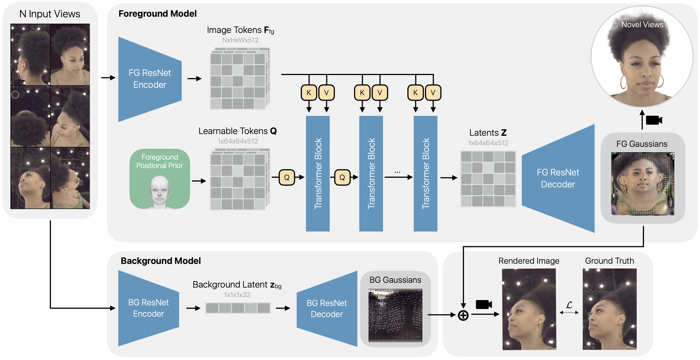

# Large-Scale High-Quality 3D Gaussian Head Reconstruction from Multi-View Captures

This repository accompanies the research paper **[Large-Scale High-Quality 3D Gaussian Head Reconstruction from Multi-View Captures](https://arxiv.org/abs/XYZ)** by *Evangelos Ntavelis, Sean Wu, Mohamad Shahbazi, Fabio Maninchedda, Dmitry Kostiaev, Artem Sevastopolsky, Vittorio Megaro, Trevor Phillips, Alejandro Blumentals, Shridhar Ravikumar, Mehak Gupta, Reinhard Knothe, Jeronimo Bayer, Matthias Vestner, Simon Schaefer, Thomas Etterlin, Christian Zimmermann, Mathias Deschler, Peter Kaufmann, Stefan Brugger, Sebastian Martin, Brian Amberg and Tom Runia* on the 3D reconstruction of faces from multi-view captures.

## Abstract

We propose HeadsUp, a scalable feed-forward method for reconstructing high-quality 3D Gaussian heads from large-scale multi-camera setups. Our method employs an efficient encoder-decoder architecture that compresses input views into a compact latent representation. This latent representation is then decoded into a set of UV-parameterized 3D Gaussians anchored to a neutral head template. This UV representation decouples the number of 3D Gaussians from the number and resolution of input images, enabling training with many high-resolution input views. We train and evaluate our model on an internal dataset with more than 10,000 subjects, which is an order of magnitude larger than existing multi-view human head datasets. HeadsUp achieves state-of-the-art reconstruction quality and generalizes to novel identities without test-time optimization. We extensively analyze the scaling behavior of our model across identities, views, and model capacity, revealing practical insights for quality-compute trade-offs. Finally, we highlight the strength of our latent space by showcasing two downstream applications: generating novel 3D identities and animating the 3D heads with expression blendshapes.



## Generated Samples

The repository provides examples of the results for our models trained on the Internal10K and [Ava-256](https://github.com/facebookresearch/ava-256) datasets.

## License

- Repository is released under [LICENSE](LICENSE).
- All visual samples provided here are licensed under [LICENSE-DATA](LICENSE_DATA).

## Citations

```
@article{ToDo,
  title={Large-Scale High-Quality 3D Gaussian Head Reconstruction from Multi-View Captures},
  author={ToDo},
  journal={arXiv preprint arXiv:TODO},
  year={2026}
}
```